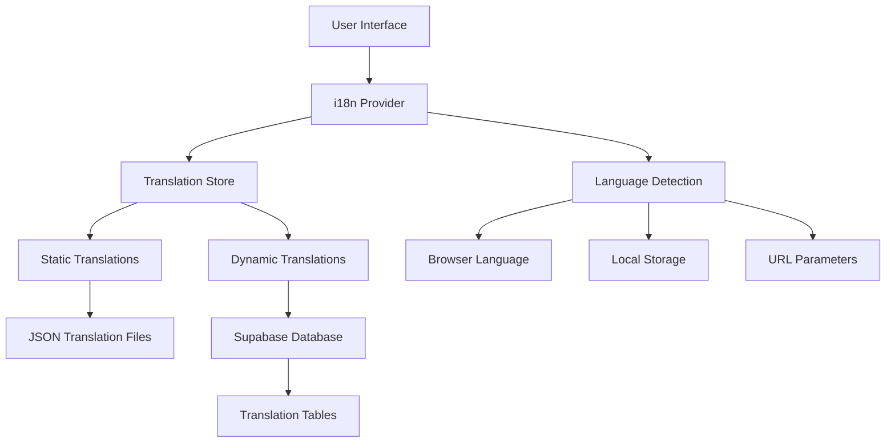

# Internationalization Design Document

## Overview

The internationalization system for Nomad Lux will provide comprehensive multi-language support for English and French, handling both static UI translations and dynamic backend content localization. The system will be built using React i18next for the frontend and a custom database-driven approach for backend content translations. The architecture prioritizes performance, scalability, and developer experience while ensuring seamless language switching across all platform features.

## Architecture

### High-Level Architecture



### Frontend Translation Architecture

The frontend will use React i18next with the following structure:

- **Translation Provider**: Wraps the entire application and provides translation context
- **Translation Store**: Zustand store managing current language and translation state
- **Translation Files**: JSON files organized by namespaces for different feature areas
- **Translation Hooks**: Custom hooks for accessing translations in components

### Backend Translation Architecture

Dynamic content translations will be stored in Supabase with the following approach:

- **Translation Tables**: Separate tables for translatable content with language-specific columns
- **Translation Service**: Custom service for fetching and caching translated content
- **Fallback System**: Automatic fallback to English when translations are missing
- **Admin Interface**: Management tools for updating translations

## Components and Interfaces

### Translation Store (Zustand)

```typescript
interface TranslationState {
  currentLanguage: "en" | "fr";
  isLoading: boolean;
  translations: Record<string, any>;
  dynamicTranslations: Record<string, Record<string, string>>;

  // Actions
  setLanguage: (language: "en" | "fr") => void;
  loadTranslations: (namespace?: string) => Promise<void>;
  loadDynamicTranslations: (type: string) => Promise<void>;
  getTranslation: (key: string, namespace?: string) => string;
  getDynamicTranslation: (type: string, id: string) => string;
}
```

### Translation Provider Component

```typescript
interface TranslationProviderProps {
  children: React.ReactNode;
  defaultLanguage?: "en" | "fr";
}

interface TranslationContextType {
  t: (key: string, options?: any) => string;
  language: "en" | "fr";
  changeLanguage: (language: "en" | "fr") => void;
  isLoading: boolean;
}
```

### Translation Service Interface

```typescript
interface TranslationService {
  getPropertyTypes: (language: "en" | "fr") => Promise<PropertyType[]>;
  getAmenities: (language: "en" | "fr") => Promise<Amenity[]>;
  getTranslatedContent: (type: string, language: "en" | "fr") => Promise<any[]>;
  updateTranslation: (
    type: string,
    id: string,
    translations: Record<string, string>
  ) => Promise<void>;
}
```

### Language Selector Component

```typescript
interface LanguageSelectorProps {
  variant?: "dropdown" | "toggle" | "buttons";
  className?: string;
  showFlags?: boolean;
}
```

## Data Models

### Static Translation Files Structure

```
src/locales/
├── en/
│   ├── common.json          # Common UI elements
│   ├── navigation.json      # Navigation and menus
│   ├── auth.json           # Authentication forms
│   ├── property.json       # Property-related content
│   ├── booking.json        # Booking process
│   ├── admin.json          # Admin panel
│   └── validation.json     # Form validation messages
└── fr/
    ├── common.json
    ├── navigation.json
    ├── auth.json
    ├── property.json
    ├── booking.json
    ├── admin.json
    └── validation.json
```

### Database Schema for Dynamic Translations

Based on the existing database structure, we'll work with:

**Existing Structure:**

- `users.language_preference` (already exists, defaults to 'en')
- `properties.property_type` (enum with values like 'apartment', 'house', etc.)
- `properties.amenities` (text array with amenity names)
- `notifications.title` and `notifications.message` (need translation)

**New Translation Tables:**

```sql
-- Translation mappings for enum values and amenities
CREATE TABLE translation_keys (
  id UUID PRIMARY KEY DEFAULT gen_random_uuid(),
  key_type VARCHAR(50) NOT NULL, -- 'property_type', 'amenity', 'notification_type', etc.
  key_value VARCHAR(100) NOT NULL, -- the actual enum value or amenity name
  translation_en TEXT NOT NULL,
  translation_fr TEXT NOT NULL,
  description_en TEXT,
  description_fr TEXT,
  created_at TIMESTAMP DEFAULT NOW(),
  updated_at TIMESTAMP DEFAULT NOW(),
  UNIQUE(key_type, key_value)
);

-- Dynamic content translations for user-generated content
CREATE TABLE content_translations (
  id UUID PRIMARY KEY DEFAULT gen_random_uuid(),
  entity_type VARCHAR(50) NOT NULL, -- 'property', 'notification', etc.
  entity_id UUID NOT NULL,
  field_name VARCHAR(50) NOT NULL, -- 'title', 'description', 'message', etc.
  language VARCHAR(2) NOT NULL,
  translation TEXT NOT NULL,
  is_auto_translated BOOLEAN DEFAULT false,
  created_at TIMESTAMP DEFAULT NOW(),
  updated_at TIMESTAMP DEFAULT NOW(),
  UNIQUE(entity_type, entity_id, field_name, language)
);

-- Store translation configurations in existing admin_settings table
-- Example entries:
-- category: 'general', setting_key: 'default_language', setting_value: '"en"'
-- category: 'general', setting_key: 'supported_languages', setting_value: '["en", "fr"]'
-- category: 'general', setting_key: 'auto_translate_enabled', setting_value: 'true'
```

### Translation Configuration

```typescript
interface TranslationConfig {
  defaultLanguage: "en" | "fr";
  supportedLanguages: ("en" | "fr")[];
  fallbackLanguage: "en";
  namespaces: string[];
  interpolation: {
    escapeValue: boolean;
    formatSeparator: string;
  };
  detection: {
    order: ("localStorage" | "navigator" | "htmlTag")[];
    caches: "localStorage"[];
  };
}
```

## Error Handling

### Translation Error Types

```typescript
enum TranslationErrorType {
  MISSING_KEY = "MISSING_KEY",
  MISSING_NAMESPACE = "MISSING_NAMESPACE",
  LOAD_FAILED = "LOAD_FAILED",
  DYNAMIC_TRANSLATION_FAILED = "DYNAMIC_TRANSLATION_FAILED",
}

interface TranslationError {
  type: TranslationErrorType;
  key?: string;
  namespace?: string;
  language: "en" | "fr";
  fallbackUsed: boolean;
}
```

### Error Handling Strategy

1. **Missing Static Translations**: Display translation key and log warning
2. **Missing Dynamic Translations**: Fall back to English, log missing translation
3. **Network Failures**: Use cached translations, retry in background
4. **Invalid Translation Data**: Use fallback values, report error to monitoring

### Fallback Mechanisms

```typescript
interface FallbackStrategy {
  staticTranslations: {
    showKey: boolean;
    useEnglish: boolean;
    logMissing: boolean;
  };
  dynamicTranslations: {
    useEnglish: boolean;
    useCache: boolean;
    retryCount: number;
  };
}
```

## Testing Strategy

### Unit Testing

1. **Translation Store Tests**

   - Language switching functionality
   - Translation loading and caching
   - Error handling and fallbacks

2. **Translation Service Tests**

   - Database query functionality
   - Translation retrieval and formatting
   - Cache management

3. **Component Tests**
   - Translation rendering in components
   - Language selector functionality
   - Dynamic content translation

### Integration Testing

1. **End-to-End Language Switching**

   - Complete user journey in both languages
   - Persistence across page reloads
   - Dynamic content updates

2. **Backend Integration**
   - Database translation queries
   - API response formatting
   - Error handling scenarios

### Performance Testing

1. **Translation Loading Performance**

   - Initial load times for translation files
   - Dynamic translation query performance
   - Memory usage with large translation sets

2. **Language Switching Performance**
   - UI update speed when switching languages
   - Cache efficiency
   - Bundle size impact

### Accessibility Testing

1. **Screen Reader Compatibility**

   - Proper language attributes on HTML elements
   - Translation announcements
   - RTL support preparation (for future languages)

2. **Keyboard Navigation**
   - Language selector accessibility
   - Focus management during language switches

## Implementation Phases

### Phase 1: Core Infrastructure

- Set up React i18next configuration
- Create translation store with Zustand
- Implement basic language detection and switching
- Create translation provider and hooks

### Phase 2: Static Content Translation

- Create translation files for all UI text
- Implement translation keys throughout components
- Add language selector component
- Set up missing translation detection

### Phase 3: Dynamic Content Translation

- Design and implement database schema
- Create translation service for backend data
- Implement property types and amenities translation
- Add admin interface for managing translations

### Phase 4: Advanced Features

- Implement translation caching strategies
- Add translation validation and testing tools
- Optimize performance and bundle size
- Add comprehensive error handling and monitoring

### Phase 5: Polish and Optimization

- Complete translation coverage audit
- Performance optimization
- Accessibility improvements
- Documentation and developer tools
