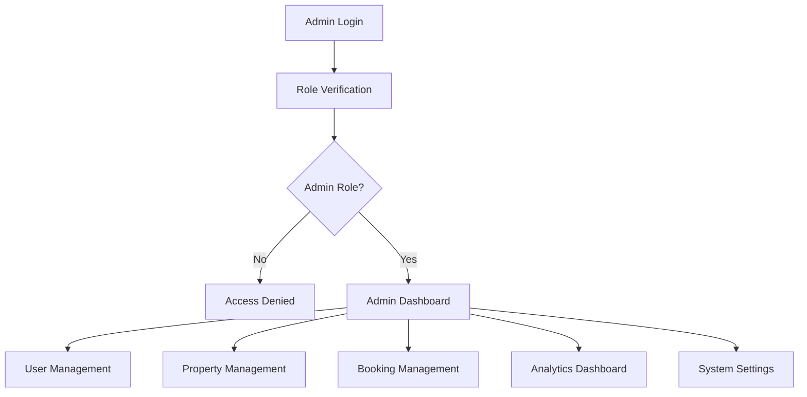

# 👑 Admin Panel System - Technical Documentation

## Overview
The Admin Panel provides comprehensive management tools for Nomad Lux administrators to oversee users, properties, bookings, and platform analytics with role-based access control.

## Technical Stack
- **React Router**: Admin routing and navigation
- **Firestore**: Admin data queries and management
- **Firebase Functions**: Admin-specific operations
- **Chart.js/Recharts**: Analytics and data visualization
- **Hero UI**: Admin interface components

## Architecture Flow



## Core Components

### 1. Admin Interface
```typescript
interface AdminUser extends User {
  role: 'admin' | 'super_admin'
  permissions: AdminPermission[]
  lastLogin: Date
  adminSince: Date
}

enum AdminPermission {
  MANAGE_USERS = 'manage_users',
  MANAGE_PROPERTIES = 'manage_properties',
  MANAGE_BOOKINGS = 'manage_bookings',
  VIEW_ANALYTICS = 'view_analytics',
  MANAGE_SETTINGS = 'manage_settings',
  MANAGE_ADMINS = 'manage_admins'
}
```

### 2. Admin Service
```typescript
class AdminService {
  // User Management
  async getAllUsers(filters?: UserFilters): Promise<User[]>
  async suspendUser(userId: string, reason: string): Promise<void>
  async activateUser(userId: string): Promise<void>
  async deleteUser(userId: string): Promise<void>
  
  // Property Management
  async getPendingProperties(): Promise<Property[]>
  async approveProperty(propertyId: string): Promise<void>
  async rejectProperty(propertyId: string, reason: string): Promise<void>
  async suspendProperty(propertyId: string, reason: string): Promise<void>
  
  // Booking Management
  async getAllBookings(filters?: BookingFilters): Promise<Booking[]>
  async cancelBooking(bookingId: string, reason: string): Promise<void>
  async refundBooking(bookingId: string, amount?: number): Promise<void>
  
  // Analytics
  async getAnalytics(dateRange: DateRange): Promise<AdminAnalytics>
  async getRevenueReport(period: 'daily' | 'weekly' | 'monthly'): Promise<RevenueReport>
}
```

## User Management

### 1. User Dashboard
```typescript
const AdminUserDashboard: React.FC = () => {
  const [users, setUsers] = useState<User[]>([])
  const [filters, setFilters] = useState<UserFilters>({})
  const [selectedUsers, setSelectedUsers] = useState<string[]>([])
  
  const { data: usersData, isLoading } = useQuery({
    queryKey: ['admin-users', filters],
    queryFn: () => adminService.getAllUsers(filters)
  })
  
  const handleBulkAction = async (action: 'suspend' | 'activate' | 'delete') => {
    for (const userId of selectedUsers) {
      switch (action) {
        case 'suspend':
          await adminService.suspendUser(userId, 'Bulk action')
          break
        case 'activate':
          await adminService.activateUser(userId)
          break
        case 'delete':
          await adminService.deleteUser(userId)
          break
      }
    }
    // Refresh data
    queryClient.invalidateQueries(['admin-users'])
  }
  
  return (
    <div className="admin-user-dashboard">
      <UserFilters filters={filters} onFiltersChange={setFilters} />
      <BulkActions
        selectedCount={selectedUsers.length}
        onBulkAction={handleBulkAction}
      />
      <UserTable
        users={usersData || []}
        selectedUsers={selectedUsers}
        onSelectionChange={setSelectedUsers}
        onUserAction={handleUserAction}
      />
    </div>
  )
}
```

### 2. User Details Modal
```typescript
const UserDetailsModal: React.FC<UserDetailsModalProps> = ({ user, onClose }) => {
  const [userBookings, setUserBookings] = useState<Booking[]>([])
  const [userProperties, setUserProperties] = useState<Property[]>([])
  
  useEffect(() => {
    Promise.all([
      bookingService.getUserBookings(user.id),
      propertyService.getUserProperties(user.id)
    ]).then(([bookings, properties]) => {
      setUserBookings(bookings)
      setUserProperties(properties)
    })
  }, [user.id])
  
  return (
    <Modal isOpen onClose={onClose} size="xl">
      <div className="user-details">
        <UserProfile user={user} />
        <Tabs>
          <Tab label="Bookings">
            <BookingsList bookings={userBookings} />
          </Tab>
          <Tab label="Properties">
            <PropertiesList properties={userProperties} />
          </Tab>
          <Tab label="Activity Log">
            <UserActivityLog userId={user.id} />
          </Tab>
        </Tabs>
      </div>
    </Modal>
  )
}
```

## Property Management

### 1. Property Approval System
```typescript
const PropertyApprovalQueue: React.FC = () => {
  const { data: pendingProperties } = useQuery({
    queryKey: ['pending-properties'],
    queryFn: adminService.getPendingProperties,
    refetchInterval: 30000 // Refresh every 30 seconds
  })
  
  const [selectedProperty, setSelectedProperty] = useState<Property | null>(null)
  const [reviewNotes, setReviewNotes] = useState('')
  
  const handleApprove = async (propertyId: string) => {
    await adminService.approveProperty(propertyId)
    queryClient.invalidateQueries(['pending-properties'])
    showSuccess('Property approved successfully')
  }
  
  const handleReject = async (propertyId: string, reason: string) => {
    await adminService.rejectProperty(propertyId, reason)
    queryClient.invalidateQueries(['pending-properties'])
    showSuccess('Property rejected')
  }
  
  return (
    <div className="property-approval-queue">
      <div className="queue-stats">
        <StatCard
          title="Pending Review"
          value={pendingProperties?.length || 0}
          icon="clock"
        />
      </div>
      
      <div className="property-grid">
        {pendingProperties?.map(property => (
          <PropertyReviewCard 
            key={property.id}
            property={property}
            onApprove={handleApprove}
            onReject={handleReject}
            onViewDetails={setSelectedProperty}
          />
        ))}
      </div>
      
      {selectedProperty && (
        <PropertyDetailsModal
          property={selectedProperty}
          onClose={() => setSelectedProperty(null)}
        />
      )}
    </div>
  )
}
```

### 2. Property Review Checklist
```typescript
const PropertyReviewChecklist: React.FC<PropertyReviewChecklistProps> = ({
  property,
  onComplete
}) => {
  const [checklist, setChecklist] = useState<ReviewItem[]>([
    { id: 'title', label: 'Title is descriptive and appropriate', checked: false },
    { id: 'description', label: 'Description is detailed and accurate', checked: false },
    { id: 'images', label: 'Images are high quality and representative', checked: false },
    { id: 'location', label: 'Location is accurate and properly set', checked: false },
    { id: 'price', label: 'Price is reasonable for the market', checked: false },
    { id: 'amenities', label: 'Amenities list is accurate and complete', checked: false },
    { id: 'policies', label: 'House rules and policies are appropriate', checked: false }
  ])
  
  const handleChecklistChange = (itemId: string, checked: boolean) => {
    setChecklist(prev => prev.map(item => 
      item.id === itemId ? { ...item, checked } : item
    ))
  }
  
  const allChecked = checklist.every(item => item.checked)
  
  return (
    <div className="property-review-checklist">
      <h3>Review Checklist</h3>
      {checklist.map(item => (
        <CheckboxItem
          key={item.id}
          label={item.label}
          checked={item.checked}
          onChange={(checked) => handleChecklistChange(item.id, checked)}
        />
      ))}
      
      <div className="checklist-actions">
        <Button
          onClick={() => onComplete('approve')}
          disabled={!allChecked}
          variant="success"
        >
          Approve Property
        </Button>
        <Button
          onClick={() => onComplete('reject')}
          variant="danger"
        >
          Reject Property
        </Button>
      </div>
    </div>
  )
}
```

## Analytics Dashboard

### 1. Admin Analytics
```typescript
interface AdminAnalytics {
  overview: {
    totalUsers: number
    totalProperties: number
    totalBookings: number
    totalRevenue: number
  }
  growth: {
    userGrowth: GrowthData[]
    propertyGrowth: GrowthData[]
    bookingGrowth: GrowthData[]
    revenueGrowth: GrowthData[]
  }
  performance: {
    topProperties: Property[]
    topHosts: User[]
    popularLocations: LocationData[]
  }
}

const AdminAnalyticsDashboard: React.FC = () => {
  const [dateRange, setDateRange] = useState<DateRange>({
    start: subDays(new Date(), 30),
    end: new Date()
  })
  
  const { data: analytics } = useQuery({
    queryKey: ['admin-analytics', dateRange],
    queryFn: () => adminService.getAnalytics(dateRange)
  })
  
  return (
    <div className="admin-analytics-dashboard">
      <DateRangePicker
        value={dateRange}
        onChange={setDateRange}
      />
      
      <div className="overview-stats">
        <StatCard
          title="Total Users"
          value={analytics?.overview.totalUsers || 0}
          change={calculateGrowth(analytics?.growth.userGrowth)}
        />
        <StatCard
          title="Total Properties"
          value={analytics?.overview.totalProperties || 0}
          change={calculateGrowth(analytics?.growth.propertyGrowth)}
        />
        <StatCard
          title="Total Bookings"
          value={analytics?.overview.totalBookings || 0}
          change={calculateGrowth(analytics?.growth.bookingGrowth)}
        />
        <StatCard
          title="Total Revenue"
          value={formatCurrency(analytics?.overview.totalRevenue || 0)}
          change={calculateGrowth(analytics?.growth.revenueGrowth)}
        />
      </div>
      
      <div className="charts-grid">
        <ChartCard title="User Growth">
          <LineChart data={analytics?.growth.userGrowth || []} />
        </ChartCard>
        
        <ChartCard title="Revenue Trend">
          <AreaChart data={analytics?.growth.revenueGrowth || []} />
        </ChartCard>
        
        <ChartCard title="Booking Distribution">
          <PieChart data={getBookingDistribution(analytics)} />
        </ChartCard>
        
        <ChartCard title="Popular Locations">
          <BarChart data={analytics?.performance.popularLocations || []} />
        </ChartCard>
      </div>
    </div>
  )
}
```

### 2. Revenue Analytics
```typescript
const RevenueAnalytics: React.FC = () => {
  const [period, setPeriod] = useState<'daily' | 'weekly' | 'monthly'>('monthly')
  
  const { data: revenueReport } = useQuery({
    queryKey: ['revenue-report', period],
    queryFn: () => adminService.getRevenueReport(period)
  })
  
  return (
    <div className="revenue-analytics">
      <div className="revenue-controls">
        <SegmentedControl
          value={period}
          onChange={setPeriod}
          options={[
            { value: 'daily', label: 'Daily' },
            { value: 'weekly', label: 'Weekly' },
            { value: 'monthly', label: 'Monthly' }
          ]}
        />
      </div>
      
      <div className="revenue-metrics">
        <MetricCard
          title="Gross Revenue"
          value={formatCurrency(revenueReport?.grossRevenue || 0)}
          subtitle="Total bookings revenue"
        />
        <MetricCard
          title="Platform Fee"
          value={formatCurrency(revenueReport?.platformFee || 0)}
          subtitle="12% service fee"
        />
        <MetricCard
          title="Host Payouts"
          value={formatCurrency(revenueReport?.hostPayouts || 0)}
          subtitle="Amount paid to hosts"
        />
        <MetricCard
          title="Net Revenue"
          value={formatCurrency(revenueReport?.netRevenue || 0)}
          subtitle="After refunds and chargebacks"
        />
      </div>
      
      <RevenueChart
        data={revenueReport?.chartData || []}
        period={period}
      />
    </div>
  )
}
```

## System Settings

### 1. Platform Configuration
```typescript
const SystemSettings: React.FC = () => {
  const [settings, setSettings] = useState<PlatformSettings>({
    serviceFeePercentage: 12,
    minimumBookingAmount: 50,
    maximumBookingAmount: 10000,
    autoApprovalEnabled: false,
    maintenanceMode: false,
    emailNotificationsEnabled: true,
    pushNotificationsEnabled: true
  })
  
  const handleSettingChange = (key: keyof PlatformSettings, value: any) => {
    setSettings(prev => ({ ...prev, [key]: value }))
  }
  
  const handleSaveSettings = async () => {
    await adminService.updatePlatformSettings(settings)
    showSuccess('Settings updated successfully')
  }
  
  return (
    <div className="system-settings">
      <SettingsSection title="Booking Settings">
        <NumberInput
          label="Service Fee Percentage"
          value={settings.serviceFeePercentage}
          onChange={(value) => handleSettingChange('serviceFeePercentage', value)}
          min={0}
          max={30}
          suffix="%"
        />
        
        <NumberInput
          label="Minimum Booking Amount"
          value={settings.minimumBookingAmount}
          onChange={(value) => handleSettingChange('minimumBookingAmount', value)}
          prefix="$"
        />
        
        <NumberInput
          label="Maximum Booking Amount"
          value={settings.maximumBookingAmount}
          onChange={(value) => handleSettingChange('maximumBookingAmount', value)}
          prefix="$"
        />
      </SettingsSection>
      
      <SettingsSection title="Property Management">
        <Switch
          label="Auto-approve properties"
          checked={settings.autoApprovalEnabled}
          onChange={(checked) => handleSettingChange('autoApprovalEnabled', checked)}
        />
      </SettingsSection>
      
      <SettingsSection title="System">
        <Switch
          label="Maintenance Mode"
          checked={settings.maintenanceMode}
          onChange={(checked) => handleSettingChange('maintenanceMode', checked)}
        />
      </SettingsSection>
      
      <div className="settings-actions">
        <Button onClick={handleSaveSettings} variant="primary">
          Save Settings
        </Button>
      </div>
    </div>
  )
}
```

## Security & Permissions

### 1. Role-Based Access Control
```typescript
const useAdminPermissions = () => {
  const { user } = useAuth()
  
  const hasPermission = useCallback((permission: AdminPermission) => {
    if (!user || user.role !== 'admin') return false
    return user.permissions?.includes(permission) || user.role === 'super_admin'
  }, [user])
  
  const canManageUsers = hasPermission(AdminPermission.MANAGE_USERS)
  const canManageProperties = hasPermission(AdminPermission.MANAGE_PROPERTIES)
  const canManageBookings = hasPermission(AdminPermission.MANAGE_BOOKINGS)
  const canViewAnalytics = hasPermission(AdminPermission.VIEW_ANALYTICS)
  
  return {
    hasPermission,
    canManageUsers,
    canManageProperties,
    canManageBookings,
    canViewAnalytics
  }
}
```

### 2. Admin Activity Logging
```typescript
const adminActivityLogger = {
  logUserAction: (action: string, targetUserId: string, details?: any) => {
    logEvent(analytics, 'admin_user_action', {
      action,
      target_user_id: targetUserId,
      admin_id: getCurrentUser()?.id,
      details: JSON.stringify(details),
      timestamp: new Date().toISOString()
    })
  },
  
  logPropertyAction: (action: string, propertyId: string, details?: any) => {
    logEvent(analytics, 'admin_property_action', {
      action,
      property_id: propertyId,
      admin_id: getCurrentUser()?.id,
      details: JSON.stringify(details),
      timestamp: new Date().toISOString()
    })
  },
  
  logSystemChange: (setting: string, oldValue: any, newValue: any) => {
    logEvent(analytics, 'admin_system_change', {
      setting,
      old_value: JSON.stringify(oldValue),
      new_value: JSON.stringify(newValue),
      admin_id: getCurrentUser()?.id,
      timestamp: new Date().toISOString()
    })
  }
}
```

## Testing Strategy

### 1. Unit Tests
- Permission checking logic
- Analytics calculations
- Settings validation
- Data filtering functions

### 2. Integration Tests
- Admin authentication flow
- CRUD operations
- Analytics data fetching
- Settings persistence

### 3. E2E Tests
- Complete admin workflows
- User management scenarios
- Property approval process
- Analytics dashboard functionality

This Admin Panel system provides comprehensive management capabilities with robust security, detailed analytics, and efficient workflow management for platform administrators. 