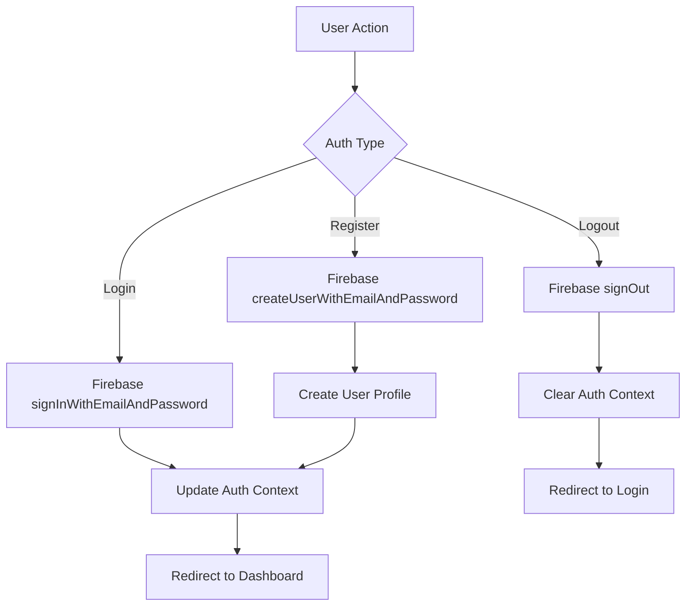

# 🔐 Authentication System - Technical Documentation

## Overview
The authentication system for Nomad Lux provides secure user registration, login, and session management using Firebase Authentication with role-based access control.

## Technical Stack
- **Firebase Authentication**: Primary auth service
- **React Context**: Auth state management
- **TypeScript**: Type safety for auth interfaces
- **Hero UI**: Authentication form components

## Architecture Flow



## Core Components

### 1. AuthContext (`src/context/AuthContext.tsx`)
```typescript
interface AuthContextType {
  user: User | null
  loading: boolean
  error: string | null
  signUp: (email: string, password: string, displayName: string) => Promise<void>
  signIn: (email: string, password: string) => Promise<void>
  signOut: () => Promise<void>
  resetPassword: (email: string) => Promise<void>
}
```

### 2. AuthService (`src/firebase/authService.ts`)
```typescript
class AuthService {
  async signUp(email: string, password: string, displayName: string): Promise<User>
  async signIn(email: string, password: string): Promise<User>
  async signOut(): Promise<void>
  async resetPassword(email: string): Promise<void>
  async updateProfile(data: Partial<UserProfile>): Promise<void>
}
```

### 3. Protected Route Component
```typescript
interface ProtectedRouteProps {
  children: React.ReactNode
  requiredRole?: UserRole
  redirectTo?: string
}
```

## User Roles & Permissions

### Role Hierarchy
1. **Guest**: Can view properties only
2. **User**: Can view, like, book properties, and add their own
3. **Admin**: Full access to all features and admin panel

### Permission Matrix
```typescript
const permissions = {
  guest: ['view_properties'],
  user: [
    'view_properties',
    'like_properties', 
    'book_properties',
    'add_properties',
    'manage_own_bookings'
  ],
  admin: ['*'] // All permissions
}
```

## Authentication Flow

### Registration Process
1. User fills registration form
2. Validate email format and password strength
3. Call Firebase `createUserWithEmailAndPassword`
4. Create user profile in Firestore
5. Send email verification
6. Update auth context
7. Redirect to onboarding/dashboard

### Login Process
1. User enters credentials
2. Validate input fields
3. Call Firebase `signInWithEmailAndPassword`
4. Fetch user profile from Firestore
5. Update auth context with user data
6. Redirect based on user role

### Password Reset
1. User enters email address
2. Call Firebase `sendPasswordResetEmail`
3. Show confirmation message
4. User receives email with reset link
5. Firebase handles password reset flow

## Security Features

### Input Validation
```typescript
const authValidation = {
  email: (email: string) => /^[^\s@]+@[^\s@]+\.[^\s@]+$/.test(email),
  password: (password: string) => password.length >= 8,
  displayName: (name: string) => name.trim().length >= 2
}
```

### Error Handling
```typescript
const authErrors = {
  'auth/user-not-found': 'No account found with this email',
  'auth/wrong-password': 'Incorrect password',
  'auth/email-already-in-use': 'Email already registered',
  'auth/weak-password': 'Password should be at least 8 characters',
  'auth/invalid-email': 'Invalid email address'
}
```

## Implementation Details

### Firebase Configuration
```typescript
// firebase/config.ts
const firebaseConfig = {
  apiKey: process.env.VITE_FIREBASE_API_KEY,
  authDomain: process.env.VITE_FIREBASE_AUTH_DOMAIN,
  projectId: process.env.VITE_FIREBASE_PROJECT_ID,
  // ... other config
}

export const auth = getAuth(app)
```

### Auth Context Provider
```typescript
export const AuthProvider: React.FC<{ children: React.ReactNode }> = ({ children }) => {
  const [user, setUser] = useState<User | null>(null)
  const [loading, setLoading] = useState(true)
  const [error, setError] = useState<string | null>(null)

  useEffect(() => {
    const unsubscribe = onAuthStateChanged(auth, async (firebaseUser) => {
      if (firebaseUser) {
        // Fetch user profile from Firestore
        const userProfile = await getUserProfile(firebaseUser.uid)
        setUser({ ...firebaseUser, ...userProfile })
      } else {
        setUser(null)
      }
      setLoading(false)
    })

    return unsubscribe
  }, [])

  // ... auth methods implementation
}
```

## UI Components

### Login Form
- Email input with validation
- Password input with show/hide toggle
- Remember me checkbox
- Forgot password link
- Social login buttons (future)

### Registration Form
- Display name input
- Email input with validation
- Password input with strength indicator
- Confirm password input
- Terms and conditions checkbox
- Profile picture upload (optional)

### Form Validation
```typescript
const useAuthForm = () => {
  const [errors, setErrors] = useState<Record<string, string>>({})
  
  const validateField = (field: string, value: string) => {
    switch (field) {
      case 'email':
        return authValidation.email(value) ? '' : 'Invalid email format'
      case 'password':
        return authValidation.password(value) ? '' : 'Password must be at least 8 characters'
      default:
        return ''
    }
  }
}
```

## Testing Strategy

### Unit Tests
- Auth service methods
- Form validation functions
- Error handling scenarios

### Integration Tests
- Complete auth flows
- Context state updates
- Route protection

### E2E Tests
- User registration journey
- Login/logout flow
- Password reset process

## Performance Considerations

### Optimization Techniques
1. **Lazy Loading**: Auth forms loaded on demand
2. **Memoization**: Auth context values memoized
3. **Debounced Validation**: Input validation debounced
4. **Persistent Sessions**: Firebase handles session persistence

## Error Handling & UX

### Loading States
- Skeleton loaders during auth checks
- Button loading states during form submission
- Progressive loading for user data

### Error Display
- Inline field validation errors
- Toast notifications for auth errors
- Fallback UI for auth failures

## Future Enhancements

### Planned Features
1. **Social Authentication**: Google, Facebook, Apple
2. **Two-Factor Authentication**: SMS/Email 2FA
3. **Biometric Authentication**: Fingerprint/Face ID
4. **Account Linking**: Link multiple auth providers
5. **Advanced Security**: Rate limiting, suspicious activity detection

## Monitoring & Analytics

### Auth Metrics
- Registration conversion rate
- Login success/failure rates
- Password reset frequency
- Session duration
- User retention

### Firebase Analytics Events
```typescript
const authAnalytics = {
  trackSignUp: (method: string) => logEvent(analytics, 'sign_up', { method }),
  trackLogin: (method: string) => logEvent(analytics, 'login', { method }),
  trackPasswordReset: () => logEvent(analytics, 'password_reset'),
}
```

This authentication system provides a secure, scalable foundation for user management in the Nomad Lux platform while maintaining excellent user experience and performance. 