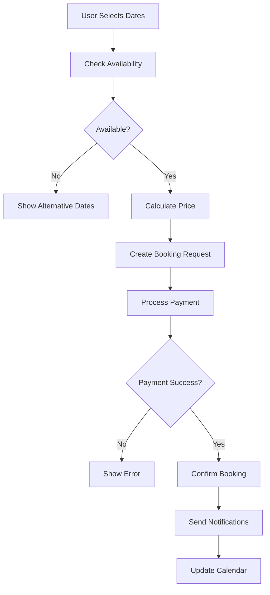

# 📅 Booking System - Technical Documentation

## Overview
The Booking System manages the complete reservation lifecycle for Nomad Lux properties, including availability checking, booking creation, payment processing, and booking management.

## Technical Stack
- **Firestore**: Booking data storage
- **Firebase Functions**: Booking logic and notifications
- **Stripe/PayPal**: Payment processing
- **date-fns**: Date manipulation and validation
- **React Query**: Booking data management

## Architecture Flow



## Core Components

### 1. Booking Interface
```typescript
interface Booking {
  id: string
  propertyId: string
  userId: string
  hostId: string
  checkIn: Date
  checkOut: Date
  guests: number
  totalPrice: number
  status: BookingStatus
  paymentStatus: PaymentStatus
  paymentId?: string
  specialRequests?: string
  createdAt: Date
  updatedAt: Date
}

enum BookingStatus {
  PENDING = 'pending',
  CONFIRMED = 'confirmed',
  CANCELLED = 'cancelled',
  COMPLETED = 'completed',
  NO_SHOW = 'no_show'
}

enum PaymentStatus {
  PENDING = 'pending',
  PAID = 'paid',
  FAILED = 'failed',
  REFUNDED = 'refunded'
}
```

### 2. Booking Service
```typescript
class BookingService {
  async checkAvailability(propertyId: string, checkIn: Date, checkOut: Date): Promise<boolean>
  async calculatePrice(propertyId: string, checkIn: Date, checkOut: Date, guests: number): Promise<PriceBreakdown>
  async createBooking(bookingData: CreateBookingData): Promise<Booking>
  async cancelBooking(bookingId: string, reason?: string): Promise<Booking>
  async getUserBookings(userId: string): Promise<Booking[]>
  async getHostBookings(hostId: string): Promise<Booking[]>
  async updateBookingStatus(bookingId: string, status: BookingStatus): Promise<Booking>
}
```

## Availability Management

### 1. Calendar System
```typescript
interface AvailabilityCalendar {
  propertyId: string
  blockedDates: DateRange[]
  bookedDates: DateRange[]
  priceOverrides: PriceOverride[]
  minimumStay: number
  maximumStay: number
}

interface DateRange {
  start: Date
  end: Date
}

interface PriceOverride {
  date: Date
  price: number
  reason: string // 'peak_season', 'special_event', etc.
}
```

### 2. Availability Checker
```typescript
const useAvailabilityChecker = (propertyId: string) => {
  const [availability, setAvailability] = useState<AvailabilityCalendar | null>(null)
  
  const checkDateRange = useCallback(async (checkIn: Date, checkOut: Date) => {
    const isAvailable = await bookingService.checkAvailability(propertyId, checkIn, checkOut)
    const conflicts = await getBookingConflicts(propertyId, checkIn, checkOut)
    
    return {
      available: isAvailable,
      conflicts,
      alternativeDates: isAvailable ? [] : await suggestAlternativeDates(propertyId, checkIn, checkOut)
    }
  }, [propertyId])
  
  return { availability, checkDateRange }
}
```

## Booking Flow Components

### 1. Date Picker Component
```typescript
const BookingDatePicker: React.FC<BookingDatePickerProps> = ({
  propertyId,
  onDateChange,
  minStay = 1,
  maxStay = 30
}) => {
  const [selectedDates, setSelectedDates] = useState<DateRange | null>(null)
  const [blockedDates, setBlockedDates] = useState<Date[]>([])
  
  const handleDateSelect = async (dates: DateRange) => {
    const availability = await checkAvailability(propertyId, dates.start, dates.end)
    
    if (availability.available) {
      setSelectedDates(dates)
      onDateChange(dates)
    } else {
      // Show error or suggest alternatives
      showAvailabilityError(availability.conflicts)
    }
  }
  
  return (
    <Calendar
      mode="range"
      selected={selectedDates}
      onSelect={handleDateSelect}
      disabled={blockedDates}
      minDate={new Date()}
      maxDate={addMonths(new Date(), 12)}
    />
  )
}
```

### 2. Price Calculator
```typescript
interface PriceBreakdown {
  basePrice: number
  nights: number
  subtotal: number
  cleaningFee: number
  serviceFee: number
  taxes: number
  total: number
  discounts?: Discount[]
}

const usePriceCalculator = (propertyId: string) => {
  const calculatePrice = useCallback(async (
    checkIn: Date,
    checkOut: Date,
    guests: number
  ): Promise<PriceBreakdown> => {
    const property = await getProperty(propertyId)
    const nights = differenceInDays(checkOut, checkIn)
    
    let basePrice = property.price
    let subtotal = basePrice * nights
    
    // Apply seasonal pricing
    const seasonalMultiplier = getSeasonalMultiplier(checkIn, checkOut)
    subtotal *= seasonalMultiplier
    
    // Apply guest pricing
    if (guests > property.baseGuests) {
      const extraGuestFee = (guests - property.baseGuests) * property.extraGuestFee
      subtotal += extraGuestFee * nights
    }
    
    // Calculate fees
    const cleaningFee = property.cleaningFee || 0
    const serviceFee = subtotal * 0.12 // 12% service fee
    const taxes = (subtotal + serviceFee) * 0.08 // 8% taxes
    
    const total = subtotal + cleaningFee + serviceFee + taxes
    
    return {
      basePrice,
      nights,
      subtotal,
      cleaningFee,
      serviceFee,
      taxes,
      total
    }
  }, [propertyId])
  
  return { calculatePrice }
}
```

## Payment Integration

### 1. Payment Service
```typescript
class PaymentService {
  async createPaymentIntent(amount: number, currency: string = 'USD'): Promise<PaymentIntent>
  async processPayment(paymentMethodId: string, amount: number): Promise<PaymentResult>
  async refundPayment(paymentId: string, amount?: number): Promise<RefundResult>
  async createPayoutToHost(hostId: string, amount: number): Promise<PayoutResult>
}

interface PaymentResult {
  success: boolean
  paymentId?: string
  error?: string
  requiresAction?: boolean
  clientSecret?: string
}
```

### 2. Payment Component
```typescript
const BookingPayment: React.FC<BookingPaymentProps> = ({
  booking,
  priceBreakdown,
  onPaymentSuccess,
  onPaymentError
}) => {
  const stripe = useStripe()
  const elements = useElements()
  const [processing, setProcessing] = useState(false)
  
  const handlePayment = async (event: FormEvent) => {
    event.preventDefault()
    
    if (!stripe || !elements) return
    
    setProcessing(true)
    
    const cardElement = elements.getElement(CardElement)
    
    try {
      // Create payment method
      const { error, paymentMethod } = await stripe.createPaymentMethod({
        type: 'card',
        card: cardElement!
      })
      
      if (error) {
        onPaymentError(error.message)
        return
      }
      
      // Process payment
      const result = await paymentService.processPayment(
        paymentMethod.id,
        priceBreakdown.total
      )
      
      if (result.success) {
        onPaymentSuccess(result.paymentId!)
      } else {
        onPaymentError(result.error!)
      }
    } catch (error) {
      onPaymentError('Payment processing failed')
    } finally {
      setProcessing(false)
    }
  }
  
  return (
    <form onSubmit={handlePayment}>
      <CardElement />
      <Button type="submit" disabled={processing || !stripe}>
        {processing ? 'Processing...' : `Pay $${priceBreakdown.total}`}
      </Button>
    </form>
  )
}
```

## Booking Management

### 1. User Bookings Dashboard
```typescript
const UserBookings: React.FC = () => {
  const { user } = useAuth()
  const { data: bookings, isLoading } = useQuery({
    queryKey: ['bookings', user?.id],
    queryFn: () => bookingService.getUserBookings(user!.id),
    enabled: !!user
  })
  
  const handleCancelBooking = async (bookingId: string) => {
    try {
      await bookingService.cancelBooking(bookingId)
      // Refresh bookings
      queryClient.invalidateQueries(['bookings', user?.id])
    } catch (error) {
      showError('Failed to cancel booking')
    }
  }
  
  return (
    <div className="user-bookings">
      {bookings?.map(booking => (
        <BookingCard
          key={booking.id}
          booking={booking}
          onCancel={handleCancelBooking}
          showCancelButton={canCancelBooking(booking)}
        />
      ))}
    </div>
  )
}
```

### 2. Host Bookings Management
```typescript
const HostBookings: React.FC = () => {
  const { user } = useAuth()
  const [selectedStatus, setSelectedStatus] = useState<BookingStatus | 'all'>('all')
  
  const { data: bookings } = useQuery({
    queryKey: ['host-bookings', user?.id, selectedStatus],
    queryFn: () => bookingService.getHostBookings(user!.id),
    select: (data) => selectedStatus === 'all' 
      ? data 
      : data.filter(booking => booking.status === selectedStatus)
  })
  
  const handleStatusUpdate = async (bookingId: string, status: BookingStatus) => {
    await bookingService.updateBookingStatus(bookingId, status)
    queryClient.invalidateQueries(['host-bookings'])
  }
  
  return (
    <div className="host-bookings">
      <BookingStatusFilter
        selectedStatus={selectedStatus}
        onStatusChange={setSelectedStatus}
      />
      
      {bookings?.map(booking => (
        <HostBookingCard
          key={booking.id}
          booking={booking}
          onStatusUpdate={handleStatusUpdate}
        />
      ))}
    </div>
  )
}
```

## Notifications System

### 1. Booking Notifications
```typescript
const bookingNotifications = {
  async sendBookingConfirmation(booking: Booking) {
    const [guest, host, property] = await Promise.all([
      getUserById(booking.userId),
      getUserById(booking.hostId),
      getPropertyById(booking.propertyId)
    ])
    
    // Send email to guest
    await emailService.send({
      to: guest.email,
      template: 'booking-confirmation',
      data: { booking, property, host }
    })
    
    // Send email to host
    await emailService.send({
      to: host.email,
      template: 'new-booking-notification',
      data: { booking, property, guest }
    })
    
    // Send push notifications
    await pushNotificationService.send({
      userId: booking.userId,
      title: 'Booking Confirmed!',
      body: `Your booking at ${property.title} is confirmed.`
    })
  },
  
  async sendCancellationNotification(booking: Booking, cancelledBy: 'guest' | 'host') {
    // Implementation for cancellation notifications
  },
  
  async sendReminders() {
    // Send check-in reminders 24 hours before
    const upcomingBookings = await getUpcomingBookings()
    
    for (const booking of upcomingBookings) {
      if (isWithin24Hours(booking.checkIn)) {
        await sendCheckInReminder(booking)
      }
    }
  }
}
```

## Booking Analytics

### 1. Booking Metrics
```typescript
const bookingAnalytics = {
  trackBookingAttempt: (propertyId: string, dates: DateRange) =>
    logEvent(analytics, 'booking_attempt', {
      property_id: propertyId,
      check_in: dates.start.toISOString(),
      check_out: dates.end.toISOString()
    }),
  
  trackBookingSuccess: (bookingId: string, amount: number) =>
    logEvent(analytics, 'booking_success', {
      booking_id: bookingId,
      value: amount,
      currency: 'USD'
    }),
  
  trackBookingCancellation: (bookingId: string, reason: string) =>
    logEvent(analytics, 'booking_cancellation', {
      booking_id: bookingId,
      reason
    })
}
```

## Testing Strategy

### 1. Unit Tests
- Date availability checking
- Price calculation logic
- Booking validation
- Payment processing

### 2. Integration Tests
- Complete booking flow
- Payment integration
- Notification system
- Calendar synchronization

### 3. E2E Tests
- End-to-end booking process
- Cancellation workflows
- Host booking management
- Payment scenarios

This Booking System provides a comprehensive solution for managing property reservations with robust availability checking, secure payment processing, and excellent user experience. 