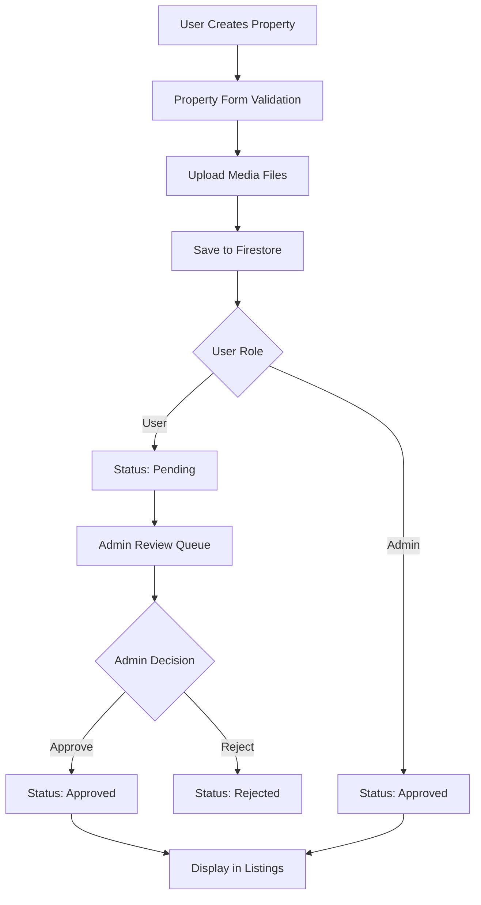

# 🏠 Property Management System - Technical Documentation

## Overview
The Property Management system handles the complete lifecycle of property listings in Nomad Lux, from creation and editing to approval and display, with advanced search and filtering capabilities.

## Technical Stack
- **Firestore**: Property data storage
- **Firebase Storage**: Image and media storage
- **React Query**: Data fetching and caching
- **Mapbox/Leaflet**: Location services and maps
- **Hero UI**: Form components and UI elements

## Architecture Flow



## Core Components

### 1. Property Interface
```typescript
interface Property {
  id: string
  hostId: string
  title: string
  description: string
  type: PropertyType
  price: number
  location: PropertyLocation
  amenities: string[]
  media: PropertyMedia
  availability: PropertyAvailability
  status: PropertyStatus
  ratings: PropertyRatings
  createdAt: Date
  updatedAt: Date
}

enum PropertyType {
  APARTMENT = 'apartment',
  HOUSE = 'house',
  VILLA = 'villa',
  STUDIO = 'studio',
  LOFT = 'loft'
}

enum PropertyStatus {
  PENDING = 'pending',
  APPROVED = 'approved',
  REJECTED = 'rejected',
  SUSPENDED = 'suspended'
}
```

### 2. Property Service
```typescript
class PropertyService {
  async createProperty(propertyData: CreatePropertyData): Promise<Property>
  async updateProperty(id: string, updates: Partial<Property>): Promise<Property>
  async deleteProperty(id: string): Promise<void>
  async getProperty(id: string): Promise<Property>
  async getProperties(filters: PropertyFilters): Promise<Property[]>
  async searchProperties(query: SearchQuery): Promise<Property[]>
  async approveProperty(id: string): Promise<Property>
  async rejectProperty(id: string, reason: string): Promise<Property>
}
```

### 3. Property Store (Zustand)
```typescript
interface PropertyStore {
  properties: Property[]
  topProperties: Property[]
  nearbyProperties: Property[]
  userProperties: Property[]
  likedProperties: Property[]
  filters: PropertyFilters
  loading: boolean
  error: string | null
  
  // Actions
  fetchProperties: (filters?: PropertyFilters) => Promise<void>
  createProperty: (data: CreatePropertyData) => Promise<void>
  updateProperty: (id: string, updates: Partial<Property>) => Promise<void>
  deleteProperty: (id: string) => Promise<void>
  likeProperty: (id: string) => Promise<void>
  unlikeProperty: (id: string) => Promise<void>
  setFilters: (filters: PropertyFilters) => void
}
```

## Property Creation Flow

### 1. Property Form Component
```typescript
interface PropertyFormProps {
  property?: Property // For editing
  onSubmit: (data: PropertyFormData) => Promise<void>
  onCancel: () => void
}

interface PropertyFormData {
  basic: {
    title: string
    description: string
    type: PropertyType
    price: number
  }
  location: {
    address: string
    city: string
    country: string
    coordinates: [number, number]
  }
  details: {
    bedrooms: number
    bathrooms: number
    maxGuests: number
    area: number
  }
  amenities: string[]
  media: File[]
  availability: {
    availableFrom: Date
    availableTo: Date
    minimumStay: number
  }
}
```

### 2. Multi-Step Form Implementation
```typescript
const PropertyForm: React.FC<PropertyFormProps> = ({ property, onSubmit }) => {
  const [currentStep, setCurrentStep] = useState(1)
  const [formData, setFormData] = useState<PropertyFormData>(initialData)
  
  const steps = [
    { id: 1, title: 'Basic Info', component: BasicInfoStep },
    { id: 2, title: 'Location', component: LocationStep },
    { id: 3, title: 'Details', component: DetailsStep },
    { id: 4, title: 'Amenities', component: AmenitiesStep },
    { id: 5, title: 'Media', component: MediaStep },
    { id: 6, title: 'Availability', component: AvailabilityStep },
    { id: 7, title: 'Review', component: ReviewStep }
  ]
  
  // Step navigation and validation logic
}
```

## Media Management

### 1. Image Upload System
```typescript
interface MediaUploadService {
  uploadImages(files: File[], propertyId: string): Promise<string[]>
  deleteImage(url: string): Promise<void>
  optimizeImage(file: File): Promise<File>
  generateThumbnails(file: File): Promise<File[]>
}

const imageOptimization = {
  maxWidth: 1920,
  maxHeight: 1080,
  quality: 0.8,
  formats: ['webp', 'jpg'],
  thumbnailSizes: [150, 300, 600]
}
```

### 2. Media Upload Component
```typescript
const MediaUpload: React.FC<MediaUploadProps> = ({ onUpload, maxFiles = 10 }) => {
  const [files, setFiles] = useState<File[]>([])
  const [uploading, setUploading] = useState(false)
  const [progress, setProgress] = useState<Record<string, number>>({})
  
  const handleUpload = async () => {
    setUploading(true)
    const uploadPromises = files.map(async (file, index) => {
      const optimizedFile = await optimizeImage(file)
      return uploadWithProgress(optimizedFile, (progress) => {
        setProgress(prev => ({ ...prev, [file.name]: progress }))
      })
    })
    
    const urls = await Promise.all(uploadPromises)
    onUpload(urls)
    setUploading(false)
  }
}
```

## Location Services

### 1. Address Autocomplete
```typescript
const AddressAutocomplete: React.FC<AddressAutocompleteProps> = ({ onSelect }) => {
  const [query, setQuery] = useState('')
  const [suggestions, setSuggestions] = useState<AddressSuggestion[]>([])
  
  const debouncedSearch = useCallback(
    debounce(async (searchQuery: string) => {
      if (searchQuery.length > 2) {
        const results = await geocodingService.search(searchQuery)
        setSuggestions(results)
      }
    }, 300),
    []
  )
  
  useEffect(() => {
    debouncedSearch(query)
  }, [query, debouncedSearch])
}
```

### 2. Map Integration
```typescript
const PropertyLocationMap: React.FC<PropertyLocationMapProps> = ({ 
  location, 
  onLocationChange,
  interactive = true 
}) => {
  const mapRef = useRef<MapRef>(null)
  
  const handleMapClick = (event: MapMouseEvent) => {
    if (interactive) {
      const { lng, lat } = event.lngLat
      onLocationChange({ lat, lng })
    }
  }
  
  return (
    <Map
      ref={mapRef}
      initialViewState={{
        longitude: location.lng,
        latitude: location.lat,
        zoom: 14
      }}
      onClick={handleMapClick}
    >
      <Marker longitude={location.lng} latitude={location.lat} />
    </Map>
  )
}
```

## Search & Filtering

### 1. Advanced Search Interface
```typescript
interface PropertyFilters {
  location?: {
    city?: string
    country?: string
    radius?: number // km
    coordinates?: [number, number]
  }
  price?: {
    min?: number
    max?: number
  }
  dates?: {
    checkIn?: Date
    checkOut?: Date
  }
  guests?: number
  type?: PropertyType[]
  amenities?: string[]
  rating?: number
  sortBy?: 'price' | 'rating' | 'distance' | 'newest'
  sortOrder?: 'asc' | 'desc'
}
```

### 2. Search Implementation
```typescript
const usePropertySearch = () => {
  const [filters, setFilters] = useState<PropertyFilters>({})
  const [results, setResults] = useState<Property[]>([])
  const [loading, setLoading] = useState(false)
  
  const searchProperties = useCallback(async (searchFilters: PropertyFilters) => {
    setLoading(true)
    try {
      // Build Firestore query based on filters
      let query = collection(db, 'properties')
        .where('status', '==', 'approved')
      
      if (searchFilters.location?.city) {
        query = query.where('location.city', '==', searchFilters.location.city)
      }
      
      if (searchFilters.price?.min) {
        query = query.where('price', '>=', searchFilters.price.min)
      }
      
      if (searchFilters.price?.max) {
        query = query.where('price', '<=', searchFilters.price.max)
      }
      
      // Execute query and apply additional filters
      const snapshot = await getDocs(query)
      let properties = snapshot.docs.map(doc => ({ id: doc.id, ...doc.data() }))
      
      // Apply complex filters that can't be done in Firestore
      properties = applyAdvancedFilters(properties, searchFilters)
      
      setResults(properties)
    } catch (error) {
      console.error('Search error:', error)
    } finally {
      setLoading(false)
    }
  }, [])
  
  return { searchProperties, results, loading, filters, setFilters }
}
```

## Admin Property Management

### 1. Admin Dashboard
```typescript
const AdminPropertyDashboard: React.FC = () => {
  const [pendingProperties, setPendingProperties] = useState<Property[]>([])
  const [selectedProperty, setSelectedProperty] = useState<Property | null>(null)
  
  const handleApprove = async (propertyId: string) => {
    await propertyService.approveProperty(propertyId)
    // Refresh pending properties
    fetchPendingProperties()
  }
  
  const handleReject = async (propertyId: string, reason: string) => {
    await propertyService.rejectProperty(propertyId, reason)
    // Refresh pending properties
    fetchPendingProperties()
  }
}
```

### 2. Property Review Component
```typescript
const PropertyReview: React.FC<PropertyReviewProps> = ({ property, onApprove, onReject }) => {
  const [rejectionReason, setRejectionReason] = useState('')
  const [showRejectModal, setShowRejectModal] = useState(false)
  
  const reviewChecklist = [
    { id: 'title', label: 'Title is descriptive and appropriate' },
    { id: 'description', label: 'Description is detailed and accurate' },
    { id: 'images', label: 'Images are high quality and representative' },
    { id: 'location', label: 'Location is accurate' },
    { id: 'price', label: 'Price is reasonable for the market' },
    { id: 'amenities', label: 'Amenities list is accurate' }
  ]
  
  return (
    <div className="property-review">
      <PropertyPreview property={property} />
      <ReviewChecklist items={reviewChecklist} />
      <div className="review-actions">
        <Button onClick={() => onApprove(property.id)} variant="success">
          Approve Property
        </Button>
        <Button onClick={() => setShowRejectModal(true)} variant="danger">
          Reject Property
        </Button>
      </div>
    </div>
  )
}
```

## Performance Optimization

### 1. Data Fetching Strategy
```typescript
// React Query implementation for property data
const useProperties = (filters: PropertyFilters) => {
  return useQuery({
    queryKey: ['properties', filters],
    queryFn: () => propertyService.getProperties(filters),
    staleTime: 5 * 60 * 1000, // 5 minutes
    cacheTime: 10 * 60 * 1000, // 10 minutes
    refetchOnWindowFocus: false
  })
}

// Infinite scroll for property listings
const useInfiniteProperties = (filters: PropertyFilters) => {
  return useInfiniteQuery({
    queryKey: ['properties', 'infinite', filters],
    queryFn: ({ pageParam = null }) => 
      propertyService.getPropertiesPaginated(filters, pageParam),
    getNextPageParam: (lastPage) => lastPage.nextCursor,
    staleTime: 5 * 60 * 1000
  })
}
```

### 2. Image Optimization
```typescript
const ImageOptimizer = {
  async processImage(file: File): Promise<ProcessedImage> {
    // Compress image
    const compressed = await imageCompression(file, {
      maxSizeMB: 1,
      maxWidthOrHeight: 1920,
      useWebWorker: true
    })
    
    // Generate WebP version
    const webpVersion = await convertToWebP(compressed)
    
    // Generate thumbnails
    const thumbnails = await generateThumbnails(compressed, [150, 300, 600])
    
    return {
      original: compressed,
      webp: webpVersion,
      thumbnails
    }
  }
}
```

## Validation & Security

### 1. Property Validation
```typescript
const propertyValidation = {
  title: (title: string) => title.length >= 10 && title.length <= 100,
  description: (desc: string) => desc.length >= 50 && desc.length <= 2000,
  price: (price: number) => price > 0 && price <= 10000,
  location: (location: PropertyLocation) => 
    location.lat >= -90 && location.lat <= 90 &&
    location.lng >= -180 && location.lng <= 180,
  images: (images: string[]) => images.length >= 3 && images.length <= 20
}

const validateProperty = (property: Partial<Property>): ValidationResult => {
  const errors: Record<string, string> = {}
  
  if (!propertyValidation.title(property.title || '')) {
    errors.title = 'Title must be between 10 and 100 characters'
  }
  
  if (!propertyValidation.description(property.description || '')) {
    errors.description = 'Description must be between 50 and 2000 characters'
  }
  
  // ... other validations
  
  return {
    isValid: Object.keys(errors).length === 0,
    errors
  }
}
```

### 2. Security Rules
```typescript
// Firestore security rules for properties
const propertySecurityRules = `
rules_version = '2';
service cloud.firestore {
  match /databases/{database}/documents {
    match /properties/{propertyId} {
      // Anyone can read approved properties
      allow read: if resource.data.status == 'approved';
      
      // Users can create properties
      allow create: if request.auth != null && 
        request.auth.uid == request.resource.data.hostId;
      
      // Only property owner or admin can update
      allow update: if request.auth != null && 
        (request.auth.uid == resource.data.hostId || 
         get(/databases/$(database)/documents/users/$(request.auth.uid)).data.role == 'admin');
      
      // Only property owner or admin can delete
      allow delete: if request.auth != null && 
        (request.auth.uid == resource.data.hostId || 
         get(/databases/$(database)/documents/users/$(request.auth.uid)).data.role == 'admin');
    }
  }
}
`;
```

## Analytics & Monitoring

### 1. Property Analytics
```typescript
const propertyAnalytics = {
  trackPropertyView: (propertyId: string) => 
    logEvent(analytics, 'property_view', { property_id: propertyId }),
  
  trackPropertyLike: (propertyId: string) => 
    logEvent(analytics, 'property_like', { property_id: propertyId }),
  
  trackPropertyShare: (propertyId: string, method: string) => 
    logEvent(analytics, 'property_share', { property_id: propertyId, method }),
  
  trackSearchQuery: (query: string, filters: PropertyFilters) => 
    logEvent(analytics, 'property_search', { query, filters: JSON.stringify(filters) })
}
```

### 2. Performance Monitoring
```typescript
const performanceMonitoring = {
  trackSearchPerformance: async (searchFunction: () => Promise<Property[]>) => {
    const startTime = performance.now()
    const results = await searchFunction()
    const endTime = performance.now()
    
    logEvent(analytics, 'search_performance', {
      duration: endTime - startTime,
      results_count: results.length
    })
    
    return results
  }
}
```

## Testing Strategy

### 1. Unit Tests
- Property validation functions
- Search and filter logic
- Image optimization utilities
- Data transformation functions

### 2. Integration Tests
- Property CRUD operations
- File upload workflows
- Search functionality
- Admin approval process

### 3. E2E Tests
- Complete property creation flow
- Property search and filtering
- Admin property management
- Property booking integration

This Property Management system provides a comprehensive solution for handling property listings with advanced features, robust validation, and excellent performance optimization. 