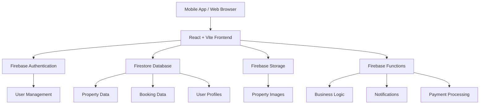

# 📚 Nomad Lux - Technical Documentation Hub

Welcome to the comprehensive technical documentation for **Nomad Lux**, a mobile-first property listing and booking platform built with modern web technologies.

## 🎯 Project Overview

Nomad Lux is an Instagram-inspired property rental platform that provides a seamless experience for users to discover, book, and manage luxury accommodations. The platform features a mobile-first design approach with advanced search capabilities, secure booking system, and comprehensive admin management tools.

## 📖 Documentation Index

### 🏗️ Architecture & Setup
- **[Technical Architecture Book](./TechnicalArchitectureBook.md)** - Complete system architecture overview covering frontend, backend, database design, and deployment strategies
- **[Project Structure](./ProjectStructureREADME.md)** - Detailed folder organization and file naming conventions
- **[Project Setup](./ProjectSetupREADME.md)** - Initial project configuration and development environment setup
- **[Migration Summary](./MigrationSummaryREADME.md)** - Project migration history and changes

### 🔐 Core Functionalities
- **[Authentication System](./AuthenticationREADME.md)** - User registration, login, role-based access control, and security features
- **[Property Management](./PropertyManagementREADME.md)** - Property listing creation, approval workflow, search, and media management
- **[Booking System](./BookingSystemREADME.md)** - Reservation management, availability checking, payment processing, and notifications
- **[Admin Panel](./AdminPanelREADME.md)** - Administrative dashboard, user management, analytics, and system settings

### 🎨 UI/UX Components
- **[UI Components System](./UIComponentsREADME.md)** - Atomic design system, responsive components, and accessibility features
- **[Hero UI Components](./HeroUIComponentsREADME.md)** - Hero UI integration and custom component implementations

## 🚀 Quick Start Guide

### Prerequisites
- Node.js 18+ 
- npm or yarn
- Firebase account
- Git

### Installation
```bash
# Clone the repository
git clone <repository-url>
cd nomad-lux

# Install dependencies
npm install

# Set up environment variables
cp .env.example .env.local
# Edit .env.local with your Firebase configuration

# Start development server
npm run dev
```

### Development Workflow
1. **Read the Architecture Book** - Start with `TechnicalArchitectureBook.md` for system overview
2. **Understand Project Structure** - Review `ProjectStructureREADME.md` for folder organization
3. **Set Up Development Environment** - Follow `ProjectSetupREADME.md` for initial setup
4. **Choose Your Feature** - Select from Authentication, Property Management, Booking, or Admin features
5. **Follow Component Guidelines** - Use `UIComponentsREADME.md` for consistent UI development

## 🏛️ System Architecture Overview



## 🛠️ Technology Stack

### Frontend
- **Framework**: React 18 + TypeScript
- **Build Tool**: Vite
- **Styling**: Tailwind CSS + Hero UI
- **State Management**: Zustand + React Query
- **Routing**: React Router v6
- **Forms**: React Hook Form
- **Animations**: Framer Motion

### Backend
- **Database**: Firebase Firestore
- **Authentication**: Firebase Auth
- **Storage**: Firebase Storage
- **Functions**: Firebase Cloud Functions
- **Hosting**: Firebase Hosting

### Development Tools
- **Package Manager**: npm
- **Linting**: ESLint + Prettier
- **Testing**: Jest + React Testing Library
- **Type Checking**: TypeScript
- **Version Control**: Git

## 📱 Key Features

### User Features
- **Property Discovery**: Advanced search with filters, map integration, and personalized recommendations
- **Booking Management**: Real-time availability, secure payments, and booking history
- **User Profiles**: Profile management, preferences, and verification
- **Social Features**: Property likes, sharing, and reviews

### Host Features
- **Property Listing**: Multi-step property creation with media upload
- **Booking Management**: Calendar management, guest communication, and earnings tracking
- **Analytics**: Property performance insights and optimization suggestions

### Admin Features
- **User Management**: User oversight, suspension, and support tools
- **Property Moderation**: Approval workflows, quality control, and compliance
- **Analytics Dashboard**: Platform metrics, revenue tracking, and performance monitoring
- **System Configuration**: Platform settings, feature flags, and maintenance tools

## 🎨 Design System

### Design Principles
- **Mobile-First**: Optimized for mobile devices with progressive enhancement
- **Instagram-Inspired**: Visual-heavy interface with story-like property browsing
- **Accessibility**: WCAG 2.1 AA compliant with keyboard navigation and screen reader support
- **Performance**: Optimized loading, lazy loading, and efficient data fetching

### Component Hierarchy
```
Hero UI Base Components (Button, Input, Card, Modal, etc.)
    ↓
Custom Shared Components (PropertyCard, SearchBar, DatePicker)
    ↓
Feature Components (Auth, Property, Booking, Admin)
    ↓
Layout Components (MainLayout, AuthLayout, AdminLayout)
    ↓
Pages (HomePage, PropertyDetail, BookingPage)
```

## 🔒 Security Features

- **Authentication**: Firebase Auth with email/password and social login
- **Authorization**: Role-based access control (Guest, User, Admin)
- **Data Security**: Firestore security rules and input validation
- **Payment Security**: PCI-compliant payment processing with Stripe
- **Privacy**: GDPR compliance and data protection measures

## 📊 Performance Optimization

- **Code Splitting**: Route-based and component-based lazy loading
- **Image Optimization**: WebP format, responsive images, and lazy loading
- **Caching**: React Query for data caching and Firebase offline persistence
- **Bundle Optimization**: Tree shaking, minification, and compression
- **CDN**: Firebase Hosting with global CDN distribution

## 🧪 Testing Strategy

### Testing Pyramid
- **Unit Tests**: Component logic, utility functions, and business logic
- **Integration Tests**: API interactions, form submissions, and user flows
- **E2E Tests**: Complete user journeys and critical business processes
- **Performance Tests**: Load testing, lighthouse audits, and core web vitals

### Testing Tools
- **Unit**: Jest + React Testing Library
- **Integration**: Cypress
- **E2E**: Playwright
- **Performance**: Lighthouse CI

## 📈 Analytics & Monitoring

- **User Analytics**: Firebase Analytics for user behavior tracking
- **Performance Monitoring**: Firebase Performance for app performance
- **Error Tracking**: Sentry for error monitoring and debugging
- **Business Metrics**: Custom dashboards for booking conversion and revenue

## 🚀 Deployment & DevOps

### Environments
- **Development**: Local development with hot reload
- **Staging**: Pre-production testing environment
- **Production**: Live application with monitoring

### CI/CD Pipeline
- **Source Control**: Git with feature branch workflow
- **Build**: Automated builds on push to main branch
- **Testing**: Automated test suite execution
- **Deployment**: Firebase Hosting with preview channels

## 📞 Support & Contributing

### Getting Help
1. Check the relevant documentation file for your feature
2. Review the Technical Architecture Book for system understanding
3. Check existing issues and discussions
4. Create a new issue with detailed description

### Contributing Guidelines
1. Follow the project structure outlined in `ProjectStructureREADME.md`
2. Use the component patterns from `UIComponentsREADME.md`
3. Write tests for new features
4. Update documentation for significant changes
5. Follow the established coding standards

## 📝 Documentation Maintenance

This documentation is actively maintained and updated with each major feature release. Each document includes:

- **Overview**: Purpose and scope of the functionality
- **Technical Details**: Implementation specifics and code examples
- **Architecture Diagrams**: Visual representation of system flow
- **Testing Guidelines**: How to test the functionality
- **Performance Considerations**: Optimization strategies
- **Security Notes**: Security implications and best practices

---

**Last Updated**: December 2024  
**Version**: 1.0.0  
**Maintainers**: Nomad Lux Development Team

For the most up-to-date information, always refer to the individual documentation files and the main project README. 